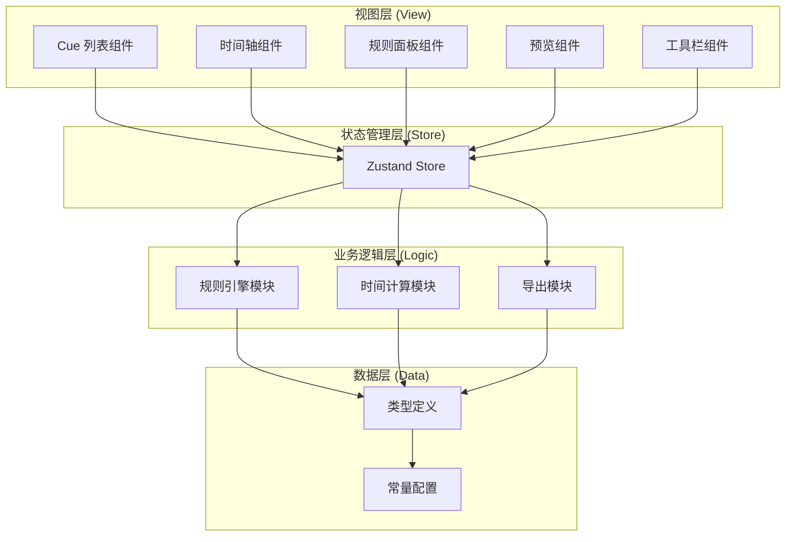

## 1. 架构设计

纯前端单页应用，采用模块化架构，各模块职责分离。



## 2. 技术描述

- **前端框架**：React 18 + TypeScript
- **构建工具**：Vite 5
- **样式方案**：Tailwind CSS 3
- **状态管理**：Zustand
- **拖拽库**：@dnd-kit/core + @dnd-kit/sortable
- **图标库**：lucide-react
- **部署方式**：Docker + Nginx 静态文件服务

## 3. 目录结构

```
src/
├── components/          # 组件目录
│   ├── CueList/        # Cue 列表组件
│   ├── Timeline/       # 时间轴组件
│   ├── RulePanel/      # 规则面板组件
│   ├── Preview/        # 预览组件
│   └── Toolbar/        # 工具栏组件
├── store/              # 状态管理
│   └── useCueStore.ts
├── modules/            # 业务模块
│   ├── rulesEngine.ts  # 规则引擎
│   ├── timeUtils.ts    # 时间计算工具
│   └── exportUtils.ts  # 导出工具
├── types/              # 类型定义
│   └── cue.ts
├── constants/          # 常量配置
│   └── config.ts
├── App.tsx             # 主应用组件
├── main.tsx            # 入口文件
└── index.css           # 全局样式
```

## 4. 核心数据模型

### 4.1 Cue 类型

```typescript
interface Cue {
  id: string;
  name: string;
  duration: number;       // 持续秒数
  formation: string;      // 目标队形代号
  switchMode: 'march' | 'run';  // 切换方式：齐步/跑步
  isTransition: boolean;  // 是否为过渡 Cue
}
```

### 4.2 规则违规类型

```typescript
interface RuleViolation {
  id: string;
  rule: string;           // 规则名称
  severity: 'error' | 'warning';
  message: string;        // 违规描述
  cueIds?: string[];      // 涉及的 Cue ID
  position?: number;      // 涉及的位置索引
}
```

### 4.3 导出数据类型

```typescript
interface ExportCue {
  index: number;
  name: string;
  formation: string;
  switchMode: string;
  isTransition: boolean;
  startTime: number;      // 开始时刻（秒）
  endTime: number;        // 结束时刻（秒）
  duration: number;
}

interface ExportData {
  totalDuration: number;
  cueCount: number;
  cues: ExportCue[];
}
```

## 5. 模块职责

### 5.1 规则引擎 (rulesEngine.ts)

独立模块，接收 Cue 数组，返回违规列表。纯函数，无副作用。

- `validateAllRules(cues: Cue[]): RuleViolation[]`
- `validateRunTransition(cues: Cue[]): RuleViolation[]`
- `validateTotalDuration(cues: Cue[]): RuleViolation[]`
- `validateFormationRepeat(cues: Cue[]): RuleViolation[]`

### 5.2 时间计算模块 (timeUtils.ts)

- `calculateTotalDuration(cues: Cue[]): number`
- `calculateCueTimings(cues: Cue[]): Array<{startTime, endTime}>`
- `getCueAtTime(cues: Cue[], time: number): Cue | null`

### 5.3 状态管理 (useCueStore.ts)

使用 Zustand 管理全局状态：

- Cue 列表
- 当前预览时间
- 违规列表（计算属性）
- Cue 增删改操作
- 拖拽排序
- 导出功能

## 6. Docker 部署配置

使用多阶段构建：
1. Node 镜像构建前端静态资源
2. Nginx 镜像提供静态文件服务

配置文件：
- `Dockerfile`
- `nginx.conf`
- `.dockerignore`
